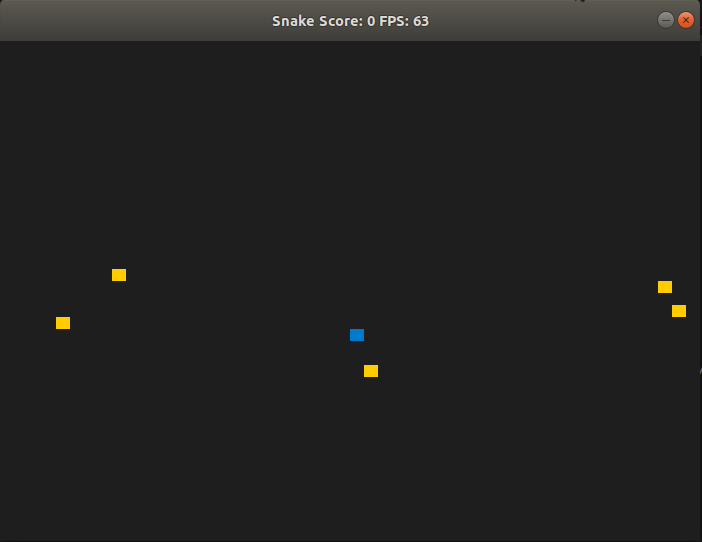
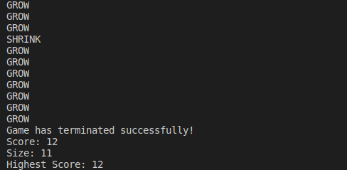
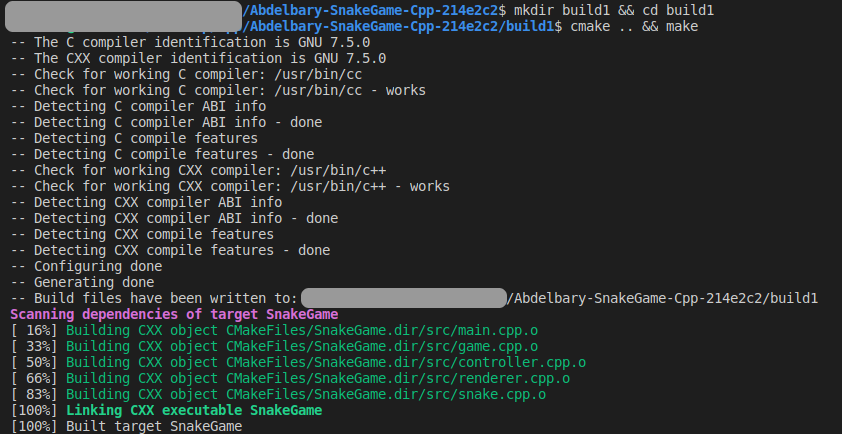

# CPPND: Capstone Snake Game Example

The code for this repo was inspired by [this](https://codereview.stackexchange.com/questions/212296/snake-game-in-c-with-sdl) excellent StackOverflow post and set of responses.

## Dependencies for Running Locally
* cmake >= 3.7
  * All OSes: [click here for installation instructions](https://cmake.org/install/)
* make >= 4.1 (Linux, Mac), 3.81 (Windows)
  * Linux: make is installed by default on most Linux distros
  * Mac: [install Xcode command line tools to get make](https://developer.apple.com/xcode/features/)
  * Windows: [Click here for installation instructions](http://gnuwin32.sourceforge.net/packages/make.htm)
* SDL2 >= 2.0
  * All installation instructions can be found [here](https://wiki.libsdl.org/Installation)
  * Note that for Linux, an `apt` or `apt-get` installation is preferred to building from source.
* gcc/g++ >= 5.4
  * Linux: gcc / g++ is installed by default on most Linux distros
  * Mac: same deal as make - [install Xcode command line tools](https://developer.apple.com/xcode/features/)
  * Windows: recommend using [MinGW](http://www.mingw.org/)

## Basic Build Instructions

1. Clone this repo.
2. Make a build directory in the top level directory: `mkdir build && cd build`
3. Compile: `cmake .. && make`
4. Run it: `./SnakeGame`.

## Game Play
  * The game has three different feeding points a normal, shrink ,killer.
  * Normal feed point grow the snake by one cell and increase it's speed.
  * Shrink feed point shring the snake back to one cell size and restore it's defult speed.
  * For each shrink feeding point taken by the player a premenent killer point will be placed on the play board.
  * If the player eaten any of the killer red points instant death is the result.
  * If the player hit his body with his head instant death is the result.
  * When the game ends it store the final score to scores file and retrieve the highest score from that file and print it in terminal

## File and Class Structure

There are 5 classes in My Submitted implementation. 

| class name | Purpose                                                                                                 |
| ---------- | ------------------------------------------------------------------------------------------------------- |
| Controller | Interact with users, let users use keyboard to control the snake in the game.                           |
| Game       | Game class stores the state in the game, the function object **run** has the game run in loops til end. |
| Renderer   | render the game to the screen.                                                                          |
| Snake      | contains attributes to keep track of the Snake speed, size, and location.                               |
| Logger     | Read, Write and print the history record for players.                                                   |

   
